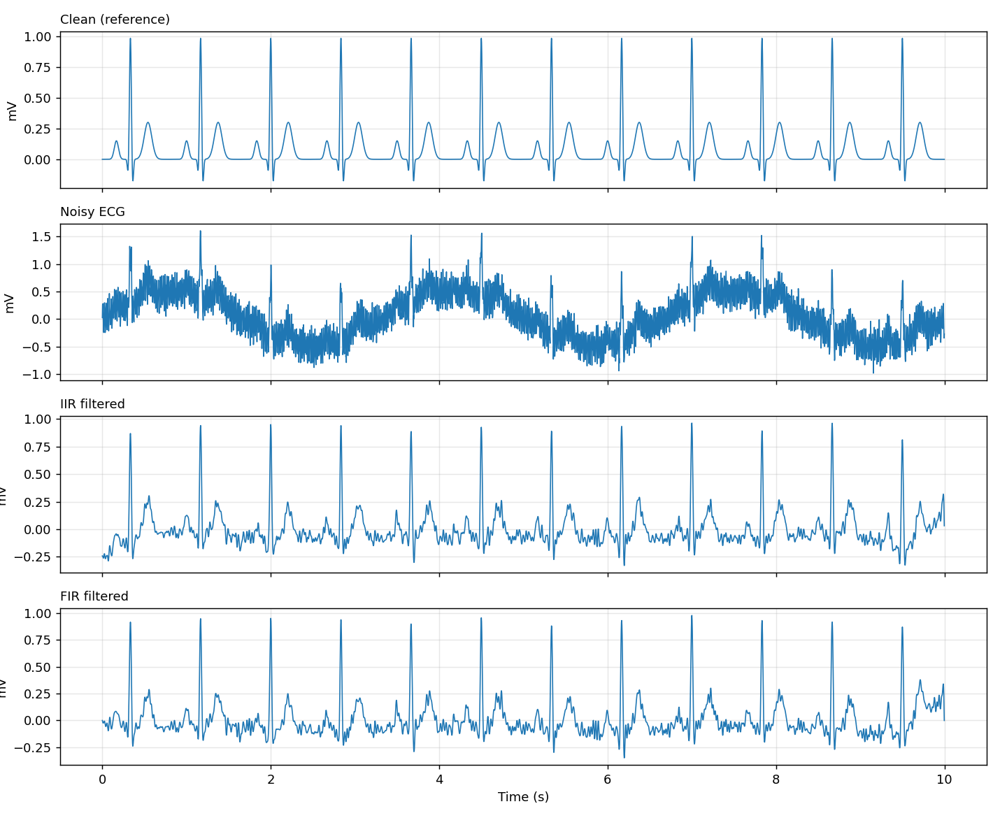
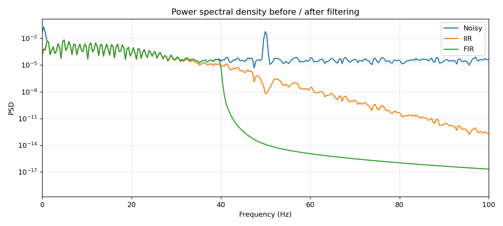
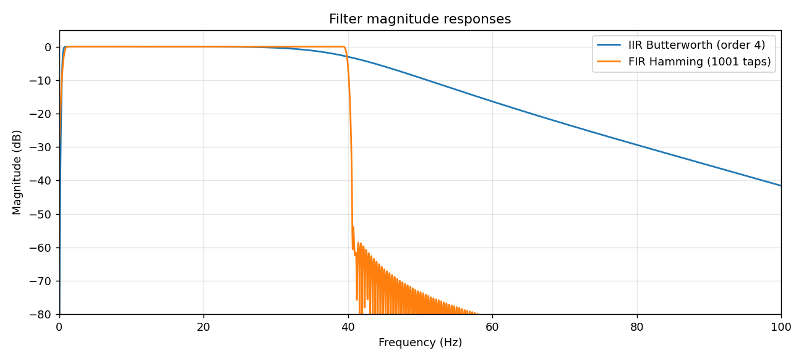

# ECG Signal Filtering (FIR vs IIR)

Removes the three most common noise sources from an ECG and compares an **IIR (Butterworth + notch)** pipeline with a **FIR (Hamming-window)** one.

| Noise | Cause | Fix |
|-------|-------|-----|
| Baseline wander (~0.3 Hz) | Breathing, movement | High-pass at 0.5 Hz |
| Powerline interference (50 Hz) | Mains hum | Notch / low-pass |
| Muscle (EMG) noise | Muscle activity | Low-pass at 40 Hz |

A synthetic ECG (P, Q, R, S, T Gaussian waves, 72 bpm, fs = 360 Hz) is used so the clean reference is known and SNR can be measured exactly. The same code works on real recordings (e.g. MIT-BIH from PhysioNet); load the samples into `noisy` instead.

## Run
```bash
pip install -r requirements.txt
python src/ecg_filter.py
```

## Results
| Signal | Output SNR |
|--------|-----------|
| Noisy | -8.20 dB |
| IIR (Butterworth 0.5-40 Hz + 50 Hz notch) | 11.87 dB |
| FIR (1001-tap Hamming 0.5-40 Hz) | 11.52 dB |





## Takeaways
- The IIR filter reaches the same quality with an order-4 filter instead of 1001 taps, which is far cheaper computationally.
- The FIR filter has exactly linear phase, which preserves the shape of the QRS complex. Both are applied with `filtfilt` (zero-phase), so neither distorts timing here.
- A real-time version would need causal filtering (`lfilter`/`sosfilt`); the FIR would then add a fixed delay, while the IIR would introduce phase distortion.

## Ideas to extend
- Load a real MIT-BIH record with the `wfdb` package.
- Add R-peak detection (Pan-Tompkins) and compute heart rate.
- Implement the filters in C for a microcontroller.
